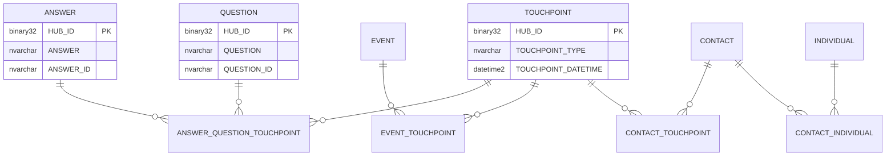
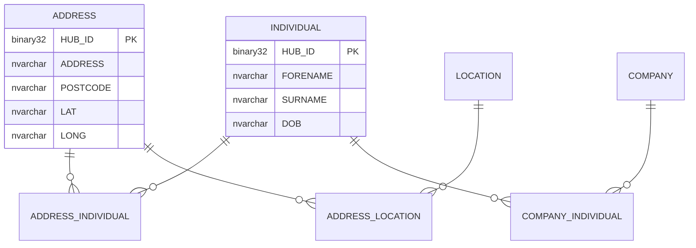

# XMS BI — Data Vault Layer Reference

> **Generated:** 2026-03-01 | **Source:** `8_DataVaultEntities.sql` (148 records, 84 unique entities)
> **Scope:** Complete entity catalog, relationship map, integration coverage, and issue register

---

## Table of Contents

1. [Architecture Overview](#1-architecture-overview)
2. [Entity Catalog — Hub/Satellite Pairs](#2-entity-catalog)
3. [Link Entities & Relationships](#3-link-entities--relationships)
4. [Link Satellite Attributes](#4-link-satellite-attributes)
5. [Entity-Relationship Diagram](#5-entity-relationship-diagram)
6. [Integration Coverage Matrix](#6-integration-coverage-matrix)
7. [DV Infrastructure & Generation Logic](#7-dv-infrastructure--generation-logic)
8. [Issues, Bugs & Inconsistencies](#8-issues-bugs--inconsistencies)
9. [Recommendations](#9-recommendations)

---

## 1. Architecture Overview

### How Entities Are Defined

Each record in `core.DataVaultEntities` defines a **combined entity**. The generation procedure (`sp_GenerateDataVaultTables`) uses a single record to produce multiple physical tables:

- **Hub entities** (no underscore in name): Generates `datavault.HUB_{NAME}`, `datavault.SAT_{NAME}`, `load.{NAME}`
- **Link entities** (underscore in name): Generates `datavault.LNK_{NAME}`, optionally `datavault.SAT_LNK_{NAME}` (if attributes exist), `load.{NAME}`

Detection is purely name-based: `CHARINDEX('_', @EntityName) > 0` = Link, otherwise = Hub.

### Entity Lifecycle

Each entity has a `RELEASE_STATE` and `VERSION`. Only the highest-version `'Live'` record is processed. States observed: `Live`, `Retired`, `Build`. Version numbers are monotonically increasing; retired versions are always lower than live.

### Key Conventions

| Convention | Detail |
|---|---|
| Hash keys | `BINARY(32)` SHA-256 via `HASHBYTES('SHA2_256', CAST(CONCAT_WS('\|', {key}, '{schema}') AS VARBINARY(MAX)))` |
| Hub PK | `HUB_ID BINARY(32)` — hash of natural business key + integration schema salt |
| Link PK | `LNK_ID BINARY(32)` — hash of all contributing hub IDs concatenated |
| SAT infrastructure | `EFFECTIVEFROM`, `EFFECTIVETO`, `CURRENT_FLAG`, `IS_DELETED`, `LOAD_TS`, `SRC` |
| CDC classification | N (new), T1 (Type 1 change), T2 (Type 2 change), NC (no change) — CHECKSUM-based |
| Sentinel joins | `CONVERT(BINARY(32), -999)` for null-safe dimension joins |
| Default data types | Strings: `NVARCHAR(255)`, Measures: `DECIMAL(38,10)`, Dates: `DATETIME2(7)`, Flags: `BIGINT` |

### Statistics Summary

| Metric | Count |
|---|---|
| Total entity records | 148 |
| Unique entity base names | 84 |
| Live Hub entities | 35 (+ 4 Build stubs) |
| Live Link entities | 40 (+ 4 Build) |
| Retired entity versions | ~64 |
| Build-only entities | 9 |
| Time-series enabled | 8 |
| Entities with MICROSERVICE_ID_BIN | 15 dimension-style hubs |

---

## 2. Entity Catalog

Hub/Satellite pairs are presented as unified entities. Each row represents a single business concept that generates a HUB + SAT table pair.

### 2.1 Transactional / Event Entities (Time-Series Enabled)

These entities have `TIME_SERIES = 1` with a designated partitioning column for range-based CDC.

#### CUSTORDER (v2 Live, Source: PoS)
Time-series column: `ORDER_DATE`

| Attribute | Type | Notes |
|---|---|---|
| GRAND_TOTAL | DECIMAL(38,10) | |
| GRAND_TOTAL_SRC | DECIMAL(38,10) | |
| DISCOUNT_GROSS | DECIMAL(38,10) | |
| DISCOUNT_GROSS_SRC | DECIMAL(38,10) | |
| SVC_CHARGE_TOTAL | DECIMAL(38,10) | |
| SVC_CHARGE_TOTAL_SRC | DECIMAL(38,10) | |
| GROSS_SALES | DECIMAL(38,10) | |
| GROSS_SALES_SRC | DECIMAL(38,10) | |
| TAX_TOTAL | DECIMAL(38,10) | |
| TAX_TOTAL_SRC | DECIMAL(38,10) | |
| NET_SALES | DECIMAL(38,10) | |
| NET_SALES_SRC | DECIMAL(38,10) | |
| GUEST_COUNT | DECIMAL(38,10) | |
| ITEM_COUNT | DECIMAL(38,10) | |
| ITEM_COUNT_SRC | DECIMAL(38,10) | |
| ORDER_COUNT | DECIMAL(38,10) | |
| OPEN_TIME | DATETIME2(7) | |
| CLOSE_TIME | DATETIME2(7) | |
| ORDER_DATE | DATETIME2(7) | Time-series column |
| TABLE_NO | NVARCHAR(255) | |
| ORDER_INFO | NVARCHAR(MAX) | |
| EXTERNAL_REFERENCE | NVARCHAR(255) | |
| ORDER_STATUS | NVARCHAR(255) | |
| PAYMENT_STATUS | NVARCHAR(255) | |
| DISCOUNT_NET | DECIMAL(38,10) | |
| DISCOUNT_NET_SRC | DECIMAL(38,10) | |
| DISCOUNT_TAX | DECIMAL(38,10) | |
| DISCOUNT_TAX_SRC | DECIMAL(38,10) | |
| TENDERED_SALES | DECIMAL(38,10) | |
| TRADING_DATE | DATETIME2(7) | |

#### LINEITEM (v3 Live, Source: PoS)
Time-series column: `ORDER_DATE`

| Attribute | Type | Notes |
|---|---|---|
| HEADER_ID | NVARCHAR(255) | |
| LINEITEM_TYPE | NVARCHAR(255) | Valid values: `PROD`, `MOD`, `TAX`, `SVC`, `DEAL`, `DISCOUNT`, `TENDER` |
| GROSS_VALUE | DECIMAL(38,10) | |
| TAX_VALUE | DECIMAL(38,10) | |
| NET_VALUE | DECIMAL(38,10) | |
| QUANTITY | DECIMAL(38,10) | |
| QUANTITY_INV | DECIMAL(38,10) | |
| LINEITEM_TIMESTAMP | DATETIME2(7) | |
| ITEM_DATE | DATETIME2(7) | |
| ORDER_DATE | DATETIME2(7) | Time-series column |
| VOID_FLAG | BIGINT | |
| LINE_ID | NVARCHAR(255) | |
| LINE_ORDER | BIGINT | |
| TRADING_DATE | DATETIME2(7) | |
| SRC_KEY | NVARCHAR(255) | |

#### POSTX (v2 Live, Source: PoS)
Time-series column: `ORDER_DATE`

| Attribute | Type | Notes |
|---|---|---|
| GRAND_TOTAL | DECIMAL(38,10) | |
| DISCOUNT_TOTAL | DECIMAL(38,10) | |
| SVC_CHARGE_TOTAL | DECIMAL(38,10) | |
| GROSS_SALES | DECIMAL(38,10) | |
| TAX_TOTAL | DECIMAL(38,10) | |
| NET_SALES | DECIMAL(38,10) | |
| GUEST_COUNT | DECIMAL(38,10) | |
| ITEM_COUNT | DECIMAL(38,10) | |
| ORDER_COUNT | DECIMAL(38,10) | |
| OPEN_TIME | DATETIME2(7) | |
| CLOSE_TIME | DATETIME2(7) | |
| ORDER_DATE | DATETIME2(7) | Time-series column |
| TABLE_NO | NVARCHAR(255) | |
| ORDER_INFO | NVARCHAR(MAX) | |
| EXTERNAL_REFERENCE | NVARCHAR(255) | |
| ORDER_STATUS | NVARCHAR(255) | |
| PAYMENT_STATUS | NVARCHAR(255) | |
| ORDER_TYPE | NVARCHAR(255) | |

#### INVREPORT (v5 Live, Source: Inventory)
Time-series column: `REPORTING_DATE`

| Attribute | Type | Notes |
|---|---|---|
| THEO_USAGE | DECIMAL(38,10) | |
| ACTUAL_USAGE | DECIMAL(38,10) | |
| THEO_COST | DECIMAL(38,10) | |
| ACTUAL_COST | DECIMAL(38,10) | |
| VARIANCE_QTY | DECIMAL(38,10) | |
| VARIANCE_VALUE | DECIMAL(38,10) | |
| WASTE_QTY | DECIMAL(38,10) | |
| WASTE_VALUE | DECIMAL(38,10) | |
| REPORTING_DATE | DATETIME2(7) | Time-series column |
| REPORTING_UOM | NVARCHAR(255) | |
| UOM_COST | DECIMAL(38,10) | |
| SALES_QTY | DECIMAL(38,10) | |
| ORDER_QTY | DECIMAL(38,10) | |
| TRANSFER_QTY | DECIMAL(38,10) | |
| COUNT_FREQUENCY | DECIMAL(38,10) | |
| COUNT_RECENCY | DECIMAL(38,10) | |

#### STOCKEVENT (v2 Live, Source: Inventory)
Time-series column: `EVENT_TS`

| Attribute | Type | Notes |
|---|---|---|
| EVENT_TYPE | NVARCHAR(255) | Valid values: `ORDER`, `TRANSFER`, `SALE`, `WASTE`, `PRODUCTION`, `COUNT`. See [`docs/stockevent-ruleset.md`](stockevent-ruleset.md) for full rules and behaviours |
| EVENT_TS | DATETIME2(7) | Time-series column |
| PACK_DESC | NVARCHAR(255) | |
| PACK_QUANTITY | DECIMAL(38,10) | |
| UOM | NVARCHAR(255) | |
| UOM_QUANITY | DECIMAL(38,10) | **BUG: Typo — should be UOM_QUANTITY** |
| EXTERNAL_REF | NVARCHAR(255) | |
| INTERNAL_REF | NVARCHAR(255) | |
| EVENT_BEHAVIOUR | NVARCHAR(255) | `+` (stock in), `-` (stock out), or `COUNT` (baseline snapshot). Determined by EVENT_TYPE — see [`docs/stockevent-ruleset.md`](stockevent-ruleset.md) |

#### STOCKORDER (v3 Live, Source: Inventory)
Time-series column: `ORDER_DATE`

| Attribute | Type | Notes |
|---|---|---|
| ORDER_DATE | DATETIME2(7) | Time-series column |
| DELIVERY_DATE | DATETIME2(7) | |
| ORDER_TOTAL | DECIMAL(38,10) | |
| ORDER_TAX | DECIMAL(38,10) | |
| ORDER_INFO | NVARCHAR(MAX) | |
| ORDER_STATUS | NVARCHAR(255) | |

#### TIMECARD (v2 Live, Source: PoS)
Time-series column: `TRADING_DATE`

| Attribute | Type | Notes |
|---|---|---|
| TRADING_DATE | DATETIME2(7) | Time-series column |
| CLOCK_IN_TS | DATETIME2(7) | |
| CLOCK_OUT_TS | DATETIME2(7) | |
| MINS_WORKED | DECIMAL(38,10) | |
| HOURS_ADJ | DECIMAL(38,10) | |
| OVERTIME_MINS | DECIMAL(38,10) | |

#### TOUCHPOINT (v2 Live, Source: NULL)
Time-series column: `TOUCHPOINT_DATETIME`

| Attribute | Type | Notes |
|---|---|---|
| TOUCHPOINT_TYPE | NVARCHAR(255) | NOT NULL |
| TOUCHPOINT_DATETIME | DATETIME2(7) | NOT NULL, time-series column |
| TOUCHPOINT_STATUS | NVARCHAR(255) | |

### 2.2 Dimension Entities — Hierarchical (Standard Pattern)

These entities share a common dimension hierarchy pattern: `{NAME}`, `PARENT_ID`, `LEVEL_NAME`, `BOTTOM_LEVEL`, `ATTR_1`–`ATTR_5`, `MICROSERVICE_ID`, `MICROSERVICE_NAME`, `MICROSERVICE_ID_BIN`. The `MICROSERVICE_*` columns form an **MDM (Master Data Management) layer** for cross-integration alignment — they must only be populated manually, never by automated staging pipelines.

**Exceptions to the standard pattern are noted in the table below.** ANSWER has no `ATTR_1`–`ATTR_5` or `MICROSERVICE_*` columns, and uses `PARENT` (not `PARENT_ID`). QUESTION has no `ATTR_1`–`ATTR_5` columns. COMP uses `PARENT` (not `PARENT_ID`) and has no `MICROSERVICE_*` columns. REVCENTER uses `REVC_NAME` as its name attribute (not `REVCENTER_NAME`).

| Entity | Version | Source | Extra Columns Beyond Standard Pattern |
|---|---|---|---|
| ANSWER | v2 | NULL | `ANSWER_ID` — **Exception: uses `PARENT` not `PARENT_ID`; no ATTR_1–ATTR_5; no MICROSERVICE columns** |
| CHANNEL | v3 | PoS | `CHANNEL_ID` |
| COMP | v2 | PoS | `IS_WASTE (BIGINT)` — **Exception: uses `PARENT` not `PARENT_ID`; no MICROSERVICE columns** |
| DEAL | v5 | PoS | `DEAL_ID` |
| DISCOUNT | v5 | NULL | `VALUE_TYPE`, `VALUE (DECIMAL)`, `IS_WASTE (BIGINT)`, `DISCOUNT_ID` |
| DISTRIBUTOR | v3 | NULL | `DISTRIBUTOR_ID` |
| EVENT | v4 | NULL | `EVENT_CODE`, `EVENT_DATE (DATETIME2)`, `EVENT_ID` |
| INVITEM | v3 | NULL | `UOM`, `INVITEM_ID` |
| LOCATION | v4 | NULL | `LOCATION_ID` |
| MOD | v4 | NULL | `MOD_ID` |
| OCCASION | v3 | NULL | `OCCASSION_ID` **BUG: Typo — double-S** |
| PRODUCT | v4 | NULL | `PRODUCT_ID` |
| QUESTION | v5 | NULL | `QUESTION (NOT NULL)`, `QUESTION_ID` — **Exception: no ATTR_1–ATTR_5 columns** |
| REVCENTER | v2 | NULL | `REVC_ID` — **Exception: name attribute is `REVC_NAME` (not `REVCENTER_NAME`)** |
| SUPPLIER | v3 | NULL | `SUPPLIER_ID` |
| SVCCHARGE | v3 | NULL | `SVC_ID` |
| TAX | v4 | NULL | `TAX_MULTIPLIER (DECIMAL)`, `TAX_ID` |
| TENDER | v3 | NULL | `TENDER_ID` |

### 2.3 Dimension Entities — Non-Hierarchical

These entities have bespoke attribute structures and do NOT follow the standard hierarchy pattern.

#### JOB (v3 Live, Source: NULL)
**Note:** Despite being POS-domain, JOB has no hierarchy columns (`PARENT_ID`, `LEVEL_NAME`, `BOTTOM_LEVEL`, `ATTR_*`) in the SQL. It is non-hierarchical.

| Attribute | Type | Notes |
|---|---|---|
| JOB_NAME | NVARCHAR(255) | |
| TRONC_FLAG | BIGINT | |
| JOB_CODE | NVARCHAR(255) | |
| PAY_CODE | NVARCHAR(255) | |
| MICROSERVICE_ID | NVARCHAR(255) | |
| MICROSERVICE_NAME | NVARCHAR(255) | |
| MICROSERVICE_ID_BIN | BINARY(32) | |

#### EMPLOYEE (v3 Live, Source: NULL)

| Attribute | Type | Notes |
|---|---|---|
| SURNAME | NVARCHAR(255) | |
| FIRST_NAME | NVARCHAR(255) | |
| MIDDLE_NAME | NVARCHAR(255) | |
| POST_DESC | NVARCHAR(255) | |
| ACTIVE_DATE | DECIMAL(38,10) | **BUG: Should be DATETIME2 — see Issues** |
| END_DATE | DECIMAL(38,10) | **BUG: Should be DATETIME2 — see Issues** |
| TRONC_OPTOUT_DATE | DATETIME2(7) | |
| PAYTYPE | NVARCHAR(255) | |
| MICROSERVICE_ID | NVARCHAR(255) | |
| MICROSERVICE_NAME | NVARCHAR(255) | |
| MICROSERVICE_ID_BIN | BINARY(32) | |

#### ADDRESS (v1 Live, Source: NULL)

| Attribute | Type | Notes |
|---|---|---|
| ADDRESS | NVARCHAR(255) | |
| POSTCODE | NVARCHAR(255) | |
| REGION | NVARCHAR(255) | |
| COUNTRY | NVARCHAR(255) | |
| LAT | NVARCHAR(255) | |
| LONG | NVARCHAR(255) | |
| TOWN | NVARCHAR(255) | |
| COUNTY | NVARCHAR(255) | |

#### COMPANY (v2 Live, Source: NULL)

| Attribute | Type | Notes |
|---|---|---|
| COMPANY_NAME | NVARCHAR(255) | |
| DOMAIN | NVARCHAR(255) | |
| URL | NVARCHAR(255) | |

#### CONTACT (v1 Live, Source: NULL)
**Note:** Uses `SPLIT_MAP = '0'` — anomalous (all other hubs use `'1'`).

| Attribute | Type | Notes |
|---|---|---|
| CONTACT | NVARCHAR(255) | |
| CONTACT_TYPE | NVARCHAR(255) | |
| OPT_OUT | BIGINT | |
| BOUNCE | BIGINT | |
| BLACKLIST | BIGINT | |
| ADJUSTED_CONTACT | NVARCHAR(255) | |

#### INDIVIDUAL (v1 Live, Source: NULL)

| Attribute | Type | Notes |
|---|---|---|
| FORENAME | NVARCHAR(255) | |
| SURNAME | NVARCHAR(255) | |
| MIDDLE_NAMES | NVARCHAR(255) | |
| TITLE | NVARCHAR(255) | |
| GENDER | NVARCHAR(255) | |
| DOB | NVARCHAR(255) | |

#### POSITEM (v1 Live, Source: NULL)

| Attribute | Type | Notes |
|---|---|---|
| ITEM_TYPE | NVARCHAR(255) | |
| GROSS_VALUE | DECIMAL(38,10) | |
| TAX_VALUE | DECIMAL(38,10) | |
| NET_VALUE | DECIMAL(38,10) | |
| QUANTITY | DECIMAL(38,10) | |
| ITEM_TIMESTAMP | DATETIME2(7) | |

#### REFUND (v1 Live, Source: NULL)

| Attribute | Type | Notes |
|---|---|---|
| REFUND_TIMESTAMP | DATETIME2(7) | |
| REFUND_VALUE | DECIMAL(38,10) | |
| REFUND_REF | NVARCHAR(255) | |
| REFUND_INFO | NVARCHAR(MAX) | |
| TAX_RECLAIM_FLAG | BIGINT | |
| REFUND_DETAIL | NVARCHAR(MAX) | |

#### ROLE (v1 Live, Source: NULL)

| Attribute | Type | Notes |
|---|---|---|
| ROLE_NAME | NVARCHAR(255) | |
| ROLE_DESC | NVARCHAR(255) | |
| CONTROL_GROUP | NVARCHAR(255) | |

### 2.4 Build-State Stub Entities (No Attributes)

These generate empty SAT tables (infrastructure columns only). No integration feeds them.

| Entity | Source | Purpose |
|---|---|---|
| ASSET | Booking | Planned booking system integration |
| BOOKING | Booking | Planned booking system integration |
| FORECAST | Multi | Planned forecasting capability |
| LINEITEMEVENT | PoS | Future event-sourcing pattern |
| POSITEMEVENT | PoS | Future event-sourcing pattern |

---

## 3. Link Entities & Relationships

Link entities use a standardised structure: `LNK_ID BINARY(32)` PK + N `{HUB}_HUB_ID BINARY(32)` foreign references + `LOAD_TS` + `SRC`. Column-level detail is only provided for Link Satellites (links with attributes).

### 3.1 Binary Links (2 Hub Endpoints) — 32 Live

| Link Entity | Hub A | Hub B | Integration Source |
|---|---|---|---|
| ADDRESS_INDIVIDUAL | ADDRESS | INDIVIDUAL | — |
| ADDRESS_LOCATION | ADDRESS | LOCATION | — |
| CHANNEL_CUSTORDER | CHANNEL | CUSTORDER | NCR |
| COMPANY_INDIVIDUAL | COMPANY | INDIVIDUAL | — |
| COMP_LINEITEM | COMP | LINEITEM | NCR |
| CONTACT_INDIVIDUAL | CONTACT | INDIVIDUAL | — |
| CONTACT_TOUCHPOINT | CONTACT | TOUCHPOINT | — |
| CUSTORDER_EMPLOYEE | CUSTORDER | EMPLOYEE | NCR |
| CUSTORDER_LINEITEM | CUSTORDER | LINEITEM | NCR, MM |
| CUSTORDER_LOCATION | CUSTORDER | LOCATION | NCR, MM |
| CUSTORDER_OCCASION | CUSTORDER | OCCASION | NCR, MM |
| CUSTORDER_POSTX | CUSTORDER | POSTX | — |
| CUSTORDER_REFUND | CUSTORDER | REFUND | — |
| CUSTORDER_REVCENTER | CUSTORDER | REVCENTER | NCR |
| DEAL_LINEITEM | DEAL | LINEITEM | NCR |
| DISCOUNT_LINEITEM | DISCOUNT | LINEITEM | NCR |
| EMPLOYEE_LINEITEM | EMPLOYEE | LINEITEM | NCR |
| EMPLOYEE_ROLE | EMPLOYEE | ROLE | — |
| EVENT_TOUCHPOINT | EVENT | TOUCHPOINT | — |
| INVITEM_INVREPORT | INVITEM | INVREPORT | MM |
| INVITEM_STOCKEVENT | INVITEM | STOCKEVENT | MM |
| INVITEM_STOCKORDER | INVITEM | STOCKORDER | MM |
| INVREPORT_LOCATION | INVREPORT | LOCATION | MM |
| LINEITEM_MOD | LINEITEM | MOD | NCR |
| LINEITEM_OCCASION | LINEITEM | OCCASION | NCR, MM |
| LINEITEM_PRODUCT | LINEITEM | PRODUCT | NCR, MM |
| LINEITEM_SVCCHARGE | LINEITEM | SVCCHARGE | NCR |
| LINEITEM_TAX | LINEITEM | TAX | NCR |
| LINEITEM_TENDER | LINEITEM | TENDER | NCR |
| LOCATION_STOCKEVENT | LOCATION | STOCKEVENT | MM |
| POSITEM_POSTX | POSITEM | POSTX | — |
| STOCKEVENT_STOCKORDER | STOCKEVENT | STOCKORDER | — |

### 3.2 Ternary Links (3 Hub Endpoints) — 5 Live

| Link Entity | Hub A | Hub B | Hub C | Has SAT_LNK | Source |
|---|---|---|---|---|---|
| ANSWER_QUESTION_TOUCHPOINT | ANSWER | QUESTION | TOUCHPOINT | No | SH |
| DISTRIBUTOR_STOCKORDER_SUPPLIER | DISTRIBUTOR | STOCKORDER | SUPPLIER | No | — |
| EMPLOYEE_JOB_TIMECARD | EMPLOYEE | JOB | TIMECARD | No | NCR |
| INVITEM_OCCASION_PRODUCT | INVITEM | OCCASION | PRODUCT | **Yes** | — |
| LOCATION_OCCASION_PRODUCT | LOCATION | OCCASION | PRODUCT | **Yes** | NCR, MM |

### 3.3 Quaternary Links (4 Hub Endpoints) — 1 Live

| Link Entity | Hub A | Hub B | Hub C | Hub D | Has SAT_LNK | Source |
|---|---|---|---|---|---|---|
| INVITEM_LOCATION_OCCASION_PRODUCT | INVITEM | LOCATION | OCCASION | PRODUCT | **Yes** | MM |

### 3.4 Self-Referencing Links — 2 Live

| Link Entity | Hub | Columns | Has SAT_LNK | Source |
|---|---|---|---|---|
| INVITEM_INVITEM | INVITEM (PARENT↔CHILD) | PARENT_HUB_ID, CHILD_HUB_ID | **Yes** | MM |
| LINEITEM_LINEITEM | LINEITEM (PARENT↔CHILD) | PARENT_HUB_ID, CHILD_HUB_ID | **Yes** | NCR |

### 3.5 Build-State Links (Not Yet Deployed)

| Link Entity | Connects | Status |
|---|---|---|
| ASSET_BOOKING_CUSTORDER | ASSET + BOOKING + CUSTORDER | Build |
| ASSET_CUSTORDER | ASSET + CUSTORDER | Build |
| LINEITEM_LINEITEMEVENT | LINEITEM + LINEITEMEVENT | Build |
| POSITEM_POSITEMEVENT | POSITEM + POSITEMEVENT | Build |

### 3.6 Retired Links

| Link Entity | Was | Superseded By |
|---|---|---|
| LINEITEM_LINEITEM v1 | Pure link (no attributes) | v2 with LABEL, VALUE, INFO |
| LOCATION_OCCASION_PRODUCT v1 | NET_PRICE, NET_COST only | v2 added PRODUCT_ID attribute |

---

## 4. Link Satellite Attributes

In this schema, link satellite attributes are **embedded directly in the link entity record** rather than as separate SAT_LNK entity definitions. Only 5 of 40 live links carry attributes.

### INVITEM_INVITEM (Self-referencing — inventory conversions)

| Attribute | Type | Purpose |
|---|---|---|
| UOM | NVARCHAR(255) | Unit of measure for conversion |
| UOM_VALUE | DECIMAL(38,10) | Conversion ratio between parent/child INVITEM |

### INVITEM_OCCASION_PRODUCT (Ternary — recipe/portion costing)

| Attribute | Type | Purpose |
|---|---|---|
| UOM | NVARCHAR(255) | Unit of measure |
| UOM_VALUE | DECIMAL(38,10) | Quantity per recipe/portion |

### INVITEM_LOCATION_OCCASION_PRODUCT (Quaternary — site-specific conversions)

| Attribute | Type | Purpose |
|---|---|---|
| UOM | NVARCHAR(255) | Unit of measure |
| UOM_VALUE | DECIMAL(38,10) | Location-specific conversion rate |

### LINEITEM_LINEITEM (Self-referencing — parent-child line items)

| Attribute | Type | Purpose |
|---|---|---|
| LABEL | NVARCHAR(255) | Relationship descriptor |
| VALUE | DECIMAL(38,10) | Numeric value (e.g., modifier price) |
| INFO | NVARCHAR(MAX) | Flexible JSON payload for metadata |

### LOCATION_OCCASION_PRODUCT (Price/cost matrix)

| Attribute | Type | Purpose |
|---|---|---|
| NET_PRICE | DECIMAL(38,10) | Selling price at location for occasion |
| NET_COST | DECIMAL(38,10) | Cost at location for occasion |
| PRODUCT_ID | NVARCHAR(255) | **ANOMALY: Denormalized hub reference — see Issues** |

---

## 5. Entity-Relationship Diagram

### 5.1 POS Domain

```mermaid
erDiagram
    EMPLOYEE ||--o{ CUSTORDER_EMPLOYEE : ""
    CUSTORDER ||--o{ CUSTORDER_EMPLOYEE : ""
    EMPLOYEE ||--o{ EMPLOYEE_LINEITEM : ""
    LINEITEM ||--o{ EMPLOYEE_LINEITEM : ""
    EMPLOYEE ||--o{ EMPLOYEE_ROLE : ""
    ROLE ||--o{ EMPLOYEE_ROLE : ""
    EMPLOYEE ||--o{ EMPLOYEE_JOB_TIMECARD : ""
    JOB ||--o{ EMPLOYEE_JOB_TIMECARD : ""
    TIMECARD ||--o{ EMPLOYEE_JOB_TIMECARD : ""

    CHANNEL ||--o{ CHANNEL_CUSTORDER : ""
    CUSTORDER ||--o{ CHANNEL_CUSTORDER : ""
    CUSTORDER ||--o{ CUSTORDER_LINEITEM : ""
    LINEITEM ||--o{ CUSTORDER_LINEITEM : ""
    CUSTORDER ||--o{ CUSTORDER_LOCATION : ""
    LOCATION ||--o{ CUSTORDER_LOCATION : ""
    CUSTORDER ||--o{ CUSTORDER_OCCASION : ""
    OCCASION ||--o{ CUSTORDER_OCCASION : ""
    CUSTORDER ||--o{ CUSTORDER_REVCENTER : ""
    REVCENTER ||--o{ CUSTORDER_REVCENTER : ""
    CUSTORDER ||--o{ CUSTORDER_POSTX : ""
    POSTX ||--o{ CUSTORDER_POSTX : ""
    CUSTORDER ||--o{ CUSTORDER_REFUND : ""
    REFUND ||--o{ CUSTORDER_REFUND : ""

    LINEITEM ||--o{ LINEITEM_PRODUCT : ""
    PRODUCT ||--o{ LINEITEM_PRODUCT : ""
    LINEITEM ||--o{ LINEITEM_OCCASION : ""
    OCCASION ||--o{ LINEITEM_OCCASION : ""
    LINEITEM ||--o{ LINEITEM_MOD : ""
    MOD ||--o{ LINEITEM_MOD : ""
    LINEITEM ||--o{ DEAL_LINEITEM : ""
    DEAL ||--o{ DEAL_LINEITEM : ""
    LINEITEM ||--o{ DISCOUNT_LINEITEM : ""
    DISCOUNT ||--o{ DISCOUNT_LINEITEM : ""
    LINEITEM ||--o{ COMP_LINEITEM : ""
    COMP ||--o{ COMP_LINEITEM : ""
    LINEITEM ||--o{ LINEITEM_TAX : ""
    TAX ||--o{ LINEITEM_TAX : ""
    LINEITEM ||--o{ LINEITEM_SVCCHARGE : ""
    SVCCHARGE ||--o{ LINEITEM_SVCCHARGE : ""
    LINEITEM ||--o{ LINEITEM_TENDER : ""
    TENDER ||--o{ LINEITEM_TENDER : ""
    LINEITEM ||--o{ LINEITEM_LINEITEM : "self-ref (parent-child)"

    POSITEM ||--o{ POSITEM_POSTX : ""
    POSTX ||--o{ POSITEM_POSTX : ""

    CUSTORDER {
        binary32 HUB_ID PK
        decimal GRAND_TOTAL
        decimal GROSS_SALES
        decimal NET_SALES
        datetime2 ORDER_DATE
    }
    LINEITEM {
        binary32 HUB_ID PK
        decimal GROSS_VALUE
        decimal NET_VALUE
        decimal QUANTITY
        datetime2 ORDER_DATE
    }
    EMPLOYEE {
        binary32 HUB_ID PK
        nvarchar SURNAME
        nvarchar FIRST_NAME
    }
    LINEITEM_LINEITEM {
        binary32 LNK_ID PK
        nvarchar LABEL
        decimal VALUE
        nvarchar_max INFO
    }
```



### 5.2 Inventory Domain

```mermaid
erDiagram
    INVITEM ||--o{ INVITEM_INVREPORT : ""
    INVREPORT ||--o{ INVITEM_INVREPORT : ""
    INVITEM ||--o{ INVITEM_STOCKEVENT : ""
    STOCKEVENT ||--o{ INVITEM_STOCKEVENT : ""
    INVITEM ||--o{ INVITEM_STOCKORDER : ""
    STOCKORDER ||--o{ INVITEM_STOCKORDER : ""
    INVITEM ||--o{ INVITEM_INVITEM : "self-ref (UOM conversion)"

    INVREPORT ||--o{ INVREPORT_LOCATION : ""
    LOCATION ||--o{ INVREPORT_LOCATION : ""
    LOCATION ||--o{ LOCATION_STOCKEVENT : ""
    STOCKEVENT ||--o{ LOCATION_STOCKEVENT : ""
    STOCKEVENT ||--o{ STOCKEVENT_STOCKORDER : ""
    STOCKORDER ||--o{ STOCKEVENT_STOCKORDER : ""

    DISTRIBUTOR ||--o{ DISTRIBUTOR_STOCKORDER_SUPPLIER : ""
    STOCKORDER ||--o{ DISTRIBUTOR_STOCKORDER_SUPPLIER : ""
    SUPPLIER ||--o{ DISTRIBUTOR_STOCKORDER_SUPPLIER : ""

    INVITEM ||--o{ INVITEM_OCCASION_PRODUCT : ""
    OCCASION ||--o{ INVITEM_OCCASION_PRODUCT : ""
    PRODUCT ||--o{ INVITEM_OCCASION_PRODUCT : ""

    INVITEM ||--o{ INVITEM_LOCATION_OCCASION_PRODUCT : ""
    LOCATION ||--o{ INVITEM_LOCATION_OCCASION_PRODUCT : ""
    OCCASION ||--o{ INVITEM_LOCATION_OCCASION_PRODUCT : ""
    PRODUCT ||--o{ INVITEM_LOCATION_OCCASION_PRODUCT : ""

    LOCATION ||--o{ LOCATION_OCCASION_PRODUCT : ""
    OCCASION ||--o{ LOCATION_OCCASION_PRODUCT : ""
    PRODUCT ||--o{ LOCATION_OCCASION_PRODUCT : ""

    INVITEM {
        binary32 HUB_ID PK
        nvarchar INVITEM_NAME
        nvarchar UOM
    }
    INVREPORT {
        binary32 HUB_ID PK
        decimal THEO_USAGE
        decimal ACTUAL_USAGE
        datetime2 REPORTING_DATE
    }
    INVITEM_INVITEM {
        binary32 LNK_ID PK
        nvarchar UOM
        decimal UOM_VALUE
    }
    LOCATION_OCCASION_PRODUCT {
        binary32 LNK_ID PK
        decimal NET_PRICE
        decimal NET_COST
        nvarchar PRODUCT_ID
    }
```



### 5.3 Survey Domain



### 5.4 CRM / Common Domain



### 5.5 Cross-Domain Bridge Entities

These entities appear in multiple domains, acting as integration bridges:

| Entity | Domains | Bridge Role |
|---|---|---|
| **PRODUCT** | POS (LINEITEM_PRODUCT), Inventory (INVITEM_*_PRODUCT, LOCATION_OCCASION_PRODUCT) | Central POS↔Inventory bridge |
| **LOCATION** | POS (CUSTORDER_LOCATION), Inventory (INVREPORT_LOCATION, LOCATION_STOCKEVENT, INVITEM_LOCATION_*), CRM (ADDRESS_LOCATION) | Universal site dimension |
| **OCCASION** | POS (CUSTORDER_OCCASION, LINEITEM_OCCASION), Inventory (INVITEM_*_OCCASION, LOCATION_OCCASION_PRODUCT) | Time-period/menu bridge |
| **INDIVIDUAL** | CRM (ADDRESS_INDIVIDUAL, COMPANY_INDIVIDUAL, CONTACT_INDIVIDUAL) | Person master |

---

## 6. Integration Coverage Matrix

### 6.1 Coverage by Integration

| Integration | Type | Explicit Mappings | Entities Fed | Type-2 SCD | Deletion Tracking |
|---|---|---|---|---|---|
| NCRAloha | POS | 34 | 28 unique | **None** | None |
| MarketMan | INVENTORY | 22 | 22 unique | 1 (LOCATION_OCCASION_PRODUCT) | None |
| SurveyHero | SURVEY | 4 | 4 unique | None | None |
| Growyze | INVENTORY | **0 in release scripts** | Unknown | N/A | N/A |
| TROAP | POS | **0 in release scripts** | Unknown | N/A | N/A |

### 6.2 Multi-Integration Entities (Fed by 2+ Integrations)

| Entity | NCR | MM | Conflict Risk |
|---|---|---|---|
| CUSTORDER | Yes | Yes | Low — hash keys include integration schema salt |
| CUSTORDER_LINEITEM | Yes | Yes | Low |
| CUSTORDER_LOCATION | Yes | Yes | Low |
| CUSTORDER_OCCASION | Yes | Yes | Low |
| LINEITEM | Yes | Yes | Low |
| LINEITEM_OCCASION | Yes | Yes | Low |
| LINEITEM_PRODUCT | Yes | Yes | Low |
| LOCATION | Yes | Yes | Low — shared dimension |
| LOCATION_OCCASION_PRODUCT | Yes | Yes | Low |
| OCCASION | Yes | Yes | Low — shared dimension |
| PRODUCT | Yes | Yes | Low — shared dimension |

### 6.3 Unmapped Live Entities (24 Total)

These entities are defined with `Live` status but have **zero** integration mappings in any release script:

**CRM/Contact cluster (9 entities):**
ADDRESS, ADDRESS_INDIVIDUAL, ADDRESS_LOCATION, COMPANY, COMPANY_INDIVIDUAL, CONTACT, CONTACT_INDIVIDUAL, CONTACT_TOUCHPOINT, INDIVIDUAL

**POS entities (11):**
COMP, CUSTORDER_POSTX, CUSTORDER_REFUND, EMPLOYEE_ROLE, EVENT, EVENT_TOUCHPOINT, POSITEM, POSITEM_POSTX, POSTX, REFUND, ROLE

**Inventory entities (4):**
DISTRIBUTOR, DISTRIBUTOR_STOCKORDER_SUPPLIER, INVITEM_OCCASION_PRODUCT, STOCKEVENT_STOCKORDER

**Partial mappings (referenced by a link mapping, but no hub-level mapping):**
TENDER (LINEITEM_TENDER link is mapped, but TENDER hub is not), COMP (COMP_LINEITEM link is mapped, but COMP hub is not)

---

## 7. DV Infrastructure & Generation Logic

### 7.1 Table Generation (sp_GenerateDataVaultTables)

**Tables generated per Hub entity:**

| Table | Columns |
|---|---|
| `datavault.HUB_{NAME}` | HUB_ID (BINARY(32) PK), SRC, IS_DELETED, LOAD_TS |
| `datavault.SAT_{NAME}` | HUB_ID + LOAD_TS (composite PK), SRC, EFFECTIVEFROM, EFFECTIVETO, CURRENT_FLAG, IS_DELETED, + all attribute columns |
| `load.{NAME}` | Same structure as SAT — staging buffer |

**Tables generated per Link entity:**

| Table | Columns |
|---|---|
| `datavault.LNK_{NAME}` | LNK_ID (BINARY(32) PK), SRC, LOAD_TS, {N}_HUB_ID columns, optional AGG columns |
| `datavault.SAT_LNK_{NAME}` | Only if attributes exist; LNK_ID + LOAD_TS (composite PK), SRC, + attribute columns. **No CURRENT_FLAG, EFFECTIVEFROM, EFFECTIVETO, or IS_DELETED** — append-only, no SCD2 tracking |
| `load.{NAME}` | Combined LNK + SAT_LNK structure |

> **SAT_LNK query pattern:** Because SAT_LNK has no `CURRENT_FLAG`, the latest record per link must be retrieved with `ROW_NUMBER() OVER (PARTITION BY LNK_ID ORDER BY LOAD_TS DESC) = 1`. Do **not** filter on `CURRENT_FLAG` — the column does not exist on these tables.

**Self-referencing links** (detected when both halves of a 2-part name are identical): Use `PARENT_HUB_ID` / `CHILD_HUB_ID` / `PARENT_AGG` / `CHILD_AGG` instead of named hub columns.

**No foreign key constraints** are generated between LNK and HUB tables. A comment in code suggests they were planned but never implemented.

### 7.2 Data Loading Pipeline

```
Integration API → DL Tables → sp_Staging (StagingControl steps)
    → sp_PopulateLoadTable → load.{ENTITY}
    → sp_UpdateEntityDeltaParameters (TIME_SERIES only)
    → sp_GenerateCDC → load.CDC_{ENTITY} (N/T1/T2/NC)
    → sp_ProcessHubSat (SCD Type 2, 10 steps) OR sp_ProcessLink (append-only)
    → sp_ProcessPresentation (all 22 steps)
```

### 7.3 CDC Classification (sp_GenerateCDC)

| Code | Meaning | Action |
|---|---|---|
| N | New record — exists in load but not in SAT | Insert into HUB + SAT |
| T1 | Type 1 change — attribute CHECKSUM differs | Delete + re-insert SAT |
| T2 | Type 2 change — type2_columns CHECKSUM differs | Close prior version + insert new |
| NC | No change — CHECKSUMs match | Reset IS_DELETED flag only |
| D | Deletion — commented out, not implemented | N/A |

### 7.4 Deployed DV Procedures

| Object | Order | Purpose |
|---|---|---|
| sp_GenerateCDC | 120 | CHECKSUM-based change classification |
| sp_PopulateLoadTable | 121 | Truncate + populate load table with dedup |
| sp_ProcessHubSat | 122 | SCD2 merge: load → HUB + SAT (10-step transaction) |
| sp_ProcessLink | 123 | Append-only: load → LNK + optional SAT_LNK |
| sp_Staging | 124 | Execute all Staging-type StagingControl steps |
| sp_InitEntityDeltaParameters | 125 | Create {ENTITY}_START/_END GlobalParameters |
| sp_UpdateEntityDeltaParameters | 126 | Update time-range params from load table |
| sp_DataVaultLoad | 129 | Master orchestrator: full pipeline per schema |
| sp_ExecuteQuery | 130 | Presentation query executor with column mapping |
| sp_ProcessPresentation | 131 | Execute all 22 PresentationControl steps |
| sp_PopulateCalendar | 132 | Fill CALENDAR table |
| sp_ProcessStagingDuplicates | 133 | Dedup staging tables before DV load |

---

## 8. Issues, Bugs & Inconsistencies

### Severity Levels
- **CRITICAL**: Will cause runtime failures or data corruption
- **HIGH**: Significant data quality issue or design flaw
- **MEDIUM**: Inconsistency that could cause confusion or subtle data issues
- **LOW**: Cosmetic/naming issues or minor design observations

---

### CRITICAL Issues

#### C1. Trailing Comma Syntax Error in Deployment DDL
**File:** `8_Deployment_Objects_Records.sql` (lines ~1841, ~1892)
**Affects:** `ForecastResults` and `ModelPerformanceHistory` CREATE TABLE statements
**Issue:** Both DDL scripts have a trailing comma before the closing `)` in their CREATE TABLE body. This is a SQL syntax error that will cause deployment failure when `sp_DeployObjects` attempts to create these tables.
**Impact:** Forecast feature tables cannot be deployed to any client database.

#### C2. sp_ProcessStagingDuplicates Called Before Variable Populated
**File:** `8_Deployment_Objects_Records.sql` (sp_DataVaultLoad)
**Issue:** `sp_ProcessStagingDuplicates` is called with `@SchemaName = @SchemaName` before the schema cursor loop populates `@SchemaName`. At this point `@SchemaName` is NULL.
**Impact:** Staging deduplication may silently fail on every DV load run, potentially allowing duplicate records into the Data Vault.

---

### HIGH Issues

#### H1. OCCASSION_ID Typo — Permanent Column Name Error
**File:** `8_DataVaultEntities.sql` — OCCASION entity (v2, v3 Live)
**Issue:** Attribute named `OCCASSION_ID` (double-S) instead of `OCCASION_ID`. This typo is baked into the generated `SAT_OCCASION` table as a physical column name. All queries must use the misspelled name.
**Scope:** Persists through all live versions. Also appears in NCRAloha mapping source columns.
**Impact:** Any developer writing queries against `SAT_OCCASION.OCCASION_ID` will get column-not-found errors.

#### H2. UOM_QUANITY Typo — Permanent Column Name Error
**File:** `8_DataVaultEntities.sql` — STOCKEVENT entity (v2 Live)
**Issue:** Attribute named `UOM_QUANITY` (missing T) instead of `UOM_QUANTITY`. Baked into `SAT_STOCKEVENT` as a physical column.
**Also in:** MarketMan mapping (`MarketMan001_Mapping.sql` ~line 564) maps source `UOM_QUANTITY` → entity column `UOM_QUANITY`.
**Impact:** Same as H1 — queries using correct spelling will fail.

#### H3. EMPLOYEE ACTIVE_DATE/END_DATE Typed as DECIMAL
**File:** `8_DataVaultEntities.sql` — EMPLOYEE entity (all versions)
**Issue:** `ACTIVE_DATE` and `END_DATE` are typed `DECIMAL(38,10)` instead of `DATETIME2(7)`. All other date columns in the system use DATETIME2. This either stores dates as numeric representations (e.g., YYYYMMDD) or is a type definition error.
**Impact:** Date arithmetic and comparisons require explicit conversion; inconsistent with system conventions.

#### H4. No Type-2 SCD Tracking for NCRAloha (Largest Integration)
**File:** `NCRAloha001_Mapping.sql` — all 34 mappings
**Issue:** Every NCRAloha entity mapping has `type2_columns = NULL`. No dimension changes from the primary POS integration are historized. Only MarketMan's LOCATION_OCCASION_PRODUCT (NET_PRICE/NET_COST) uses Type-2.
**Impact:** Historical dimension changes (e.g., product name changes, location renames, price changes) are silently overwritten with no audit trail.

#### H5. TENDER and COMP Hubs Mapped Only Via Links
**File:** `NCRAloha001_Mapping.sql`
**Issue:** `LINEITEM_TENDER` and `COMP_LINEITEM` links are mapped, but the `TENDER` and `COMP` hub entities themselves have no mapping. Hub records are created via hash-key derivation during link processing, but satellite attributes (TENDER_NAME, COMP_NAME, etc.) are never populated.
**Impact:** `SAT_TENDER` and `SAT_COMP` tables will contain only infrastructure columns with NULL attributes. Any presentation query joining to these dimensions will get empty names.

#### H6. PRODUCT_ID Denormalization in LOCATION_OCCASION_PRODUCT Link Satellite
**File:** `8_DataVaultEntities.sql` — LOCATION_OCCASION_PRODUCT v2
**Issue:** The link satellite carries a `PRODUCT_ID NVARCHAR(255)` attribute despite PRODUCT being one of the hub endpoints of this same link. This is a denormalized reference that violates DV2 principles and creates potential drift if PRODUCT business keys change.
**Impact:** Data inconsistency risk if PRODUCT_ID in the satellite diverges from the PRODUCT hub's business key.

---

### MEDIUM Issues

#### M1. LEVE_NAME Typo in NCRAloha CHANNEL Mapping
**File:** `NCRAloha001_Mapping.sql` (~line 12)
**Issue:** Source column `LEVE_NAME` (missing 'L') maps to entity column `LEVEL_NAME`. Will produce NULLs unless the DL table also uses the misspelled name.
**Impact:** CHANNEL hierarchy LEVEL_NAME may be permanently NULL from NCRAloha.

#### M2. EVENT_BEHANIOUR Typo in MarketMan STOCKEVENT Mapping
**File:** `MarketMan001_Mapping.sql` (~line 563)
**Issue:** Source column `EVENT_BEHANIOUR` (misspelled) maps to entity column `EVENT_BEHAVIOUR`. Will produce NULLs if DL table uses correct spelling.

#### M3. Fragile MICROSERVICE Filter in sp_GenerateCDC
**File:** `8_Deployment_Objects_Records.sql` (sp_GenerateCDC)
**Issue:** Filter uses `!= '[MICROSERVICE%'` (literal string comparison) instead of `NOT LIKE '[MICROSERVICE%'`. The intent is to exclude MICROSERVICE columns from CDC checksums, but the current code only excludes columns literally named `[MICROSERVICE%]`.
**Impact:** MICROSERVICE columns may be incorrectly included in CDC checksums, causing spurious T1/T2 change detections.

#### M4. Missing Steps 7–8 in sp_ProcessHubSat
**File:** `8_Deployment_Objects_Records.sql` (sp_ProcessHubSat)
**Issue:** Step numbering jumps from 6 to 9. Steps 7–8 are missing (likely planned deletion handling that was removed). The step numbering is cosmetic but suggests incomplete implementation.

#### M5. CONTACT Uses SPLIT_MAP '0' — Undocumented Convention
**File:** `8_DataVaultEntities.sql` — CONTACT entity (v1 Live)
**Issue:** All other hub entities use SPLIT_MAP `'1'`. CONTACT uses `'0'`, and its links (CONTACT_INDIVIDUAL, CONTACT_TOUCHPOINT) use `'0_1'`. The meaning of `'0'` vs `'1'` is not documented.
**Impact:** May cause unexpected behaviour in sp_GenerateDataVaultTables or mapping procedures if the SPLIT_MAP convention is relied upon.

#### M6. Growyze and TROAP Have Zero Entity Mappings in Release Scripts
**Files:** `Growyze/` and `TROAP/` folders
**Issue:** Both integrations call `UploadEntityMappings` but have no mapping SQL files in the release scripts. Either mappings are managed in-database or these integrations are incomplete.
**Impact:** Cannot verify DV coverage for 2 of 5 integrations from release scripts alone.

#### M7. No Deletion Tracking Across All Integrations
**Files:** All `*_Mapping.sql` files
**Issue:** All entity mappings have `track_deletions = 0`. Source system soft deletes are never propagated.
**Impact:** Deleted records in source systems remain as active records in the Data Vault indefinitely.

---

### LOW Issues

#### L1. TENDER Schema Structural Discontinuity
**Entity:** TENDER v1 (Retired) → v2–v3 (Live)
**Issue:** TENDER v1 was an event-style entity (TENDER_TIMESTAMP, TENDER_VALUE, etc.) completely restructured to a dimension-style entity in v2+ (TENDER_NAME, PARENT_ID, hierarchy pattern). Historical data from v1 has no mapping to v2+.

#### L2. INVREPORT Structural Discontinuity
**Entity:** INVREPORT v1–v3 → v4–v5
**Issue:** Older versions included `*_SRC` duplicate columns removed in v4. v4+ added SALES_QTY, ORDER_QTY, TRANSFER_QTY columns. Cross-version comparisons unreliable.

#### L3. No FK Constraints Between LNK and HUB Tables
**File:** `6_GenerateDataVaultTables.sql`
**Issue:** Comment says "FK constraints will be added after all tables are created" but no code implements this. Referential integrity between links and hubs is entirely trust-based.

#### L4. 24 Live Entities Never Mapped by Any Integration
**Scope:** ADDRESS cluster (3), CRM cluster (6), POS entities (POSTX, POSITEM, REFUND, etc.), Inventory entities (DISTRIBUTOR, STOCKEVENT_STOCKORDER)
**Issue:** These entities generate physical tables but receive no data from any integration. They are either planned for future use or vestigial.

#### L5. FORECAST Hub — Orphaned Build Stub
**Entity:** FORECAST (v1, Build, PRIMARY_SOURCE_TYPE=Multi)
**Issue:** No attributes, no links reference it, no integration maps to it. Completely isolated entity placeholder.

#### L6. No Explicit `Build` or `Retired` State Filtering for Entities Referenced in Links
**Issue:** Link entities reference hub entities by name convention, but there is no validation that referenced hubs are in `Live` state. Build-state links (e.g., ASSET_CUSTORDER) reference Build-state hubs (ASSET), which is consistent, but this is not enforced.

---

## 9. Recommendations

### Immediate Fixes (Critical/High)

| # | Issue | Recommended Fix |
|---|---|---|
| 1 | **C1** — Trailing comma DDL syntax error | Remove trailing commas from ForecastResults and ModelPerformanceHistory DDL in `8_Deployment_Objects_Records.sql` |
| 2 | **C2** — sp_ProcessStagingDuplicates called with NULL | Move the `sp_ProcessStagingDuplicates` call inside the schema cursor loop, after `@SchemaName` is populated |
| 3 | **H1** — OCCASSION_ID typo | Add new entity version (v4) with corrected `OCCASION_ID`; add migration script to rename column in deployed databases |
| 4 | **H2** — UOM_QUANITY typo | Add new STOCKEVENT version (v3) with corrected `UOM_QUANTITY`; add migration script |
| 5 | **H3** — EMPLOYEE dates as DECIMAL | Evaluate whether this is intentional; if not, add new version with DATETIME2 type and migration |
| 6 | **H4** — No Type-2 SCD for NCRAloha | Identify key dimension entities (PRODUCT, LOCATION, DISCOUNT) that should track historical changes; add type2_columns to their mappings |
| 7 | **H5** — TENDER/COMP hubs unmapped | Add hub entity mappings for TENDER and COMP in NCRAloha to populate satellite attributes |
| 8 | **H6** — PRODUCT_ID denormalization | Remove PRODUCT_ID from LOCATION_OCCASION_PRODUCT link satellite in next entity version; rely on the link's hub reference |

### Medium-Term Improvements

| # | Issue | Recommended Action |
|---|---|---|
| 9 | **M3** — MICROSERVICE filter | Change `!=` to `NOT LIKE` in sp_GenerateCDC MICROSERVICE column exclusion |
| 10 | **M1, M2** — Source column typos | Verify DL table column names match; fix whichever side is incorrect |
| 11 | **M5** — CONTACT SPLIT_MAP '0' | Document the meaning of SPLIT_MAP values; verify generation handles '0' correctly |
| 12 | **M6** — Growyze/TROAP no mappings | Add mapping SQL files to release scripts or document the alternative mapping pathway |
| 13 | **M7** — No deletion tracking | Evaluate implementing `track_deletions = 1` for at least dimension entities to handle source system deletes |
| 14 | **L3** — No FK constraints | Implement FK constraints or document the intentional absence |
| 15 | **L4** — 24 unmapped entities | Audit and either map, retire, or document as planned-for-future |

---

## Appendix A: Version History Summary

Entities that have undergone multiple versions, showing evolution pattern:

| Entity | Versions | Key Changes Across Versions |
|---|---|---|
| DEAL | 5 | Progressive: DEAL_ID → MICROSERVICE fields → MICROSERVICE_ID_BIN |
| DISCOUNT | 5 | Progressive: similar MICROSERVICE field additions |
| INVREPORT | 5 | Structural: removed *_SRC columns (v4), added operational metrics (v5) |
| QUESTION | 5 | Significant: grew from 2 to 8 attributes across versions |
| EVENT | 4 | Progressive: MICROSERVICE field additions |
| LOCATION | 4 | Progressive: MICROSERVICE field additions |
| MOD | 4 | Progressive: MICROSERVICE field additions |
| PRODUCT | 4 | Progressive: MICROSERVICE field additions |
| TAX | 4 | Progressive: TAX_MULTIPLIER added, MICROSERVICE fields |
| CHANNEL | 3 | Progressive: MICROSERVICE_ID_BIN added in v3 |
| DISTRIBUTOR | 3 | Progressive: MICROSERVICE_ID_BIN added in v3 |
| EMPLOYEE | 3 | Progressive: MICROSERVICE_ID_BIN added in v3 |
| INVITEM | 3 | Progressive: MICROSERVICE_ID_BIN added in v3 |
| JOB | 3 | Progressive: MICROSERVICE_ID_BIN added in v3 |
| OCCASION | 3 | Progressive: MICROSERVICE_ID_BIN added (typo persists) |
| STOCKORDER | 3 | Structural: v1 empty stub → v2 attributes → v3 TIME_SERIES |
| SUPPLIER | 3 | Progressive: MICROSERVICE_ID_BIN added in v3 |
| SVCCHARGE | 3 | Progressive: MICROSERVICE_ID_BIN added in v3 |
| TENDER | 3 | Structural: complete redesign from event-style (v1) to dimension-style (v2+) |

## Appendix B: Primary Source Type Distribution

| Source Type | Hub Entities |
|---|---|
| NULL (integration-agnostic) | ADDRESS, ANSWER, COMPANY, CONTACT, DISCOUNT, DISTRIBUTOR, EMPLOYEE, EVENT, INDIVIDUAL, INVITEM, JOB, LOCATION, MOD, OCCASION, POSITEM, PRODUCT, QUESTION, REFUND, REVCENTER, ROLE, SUPPLIER, SVCCHARGE, TAX, TENDER (24) |
| PoS | CHANNEL, COMP, CUSTORDER, DEAL, LINEITEM, LINEITEMEVENT, POSTX, TIMECARD (8) |
| Inventory | INVREPORT, STOCKEVENT, STOCKORDER (3) |
| Booking | ASSET, BOOKING (2 — Build only) |
| Multi | FORECAST (1 — Build only) |

## Appendix C: Common Attribute Patterns

### Standard Dimension Hierarchy Pattern (18 entities)
Used by: CHANNEL, COMP, DEAL, DISCOUNT, DISTRIBUTOR, EVENT, INVITEM, JOB, LOCATION, MOD, OCCASION, PRODUCT, QUESTION, REVCENTER, SUPPLIER, SVCCHARGE, TAX, TENDER

```
{ENTITY}_NAME       NVARCHAR(255)    -- Display name
PARENT_ID           NVARCHAR(255)    -- Hierarchy parent reference
LEVEL_NAME          NVARCHAR(255)    -- Hierarchy level label
BOTTOM_LEVEL        BIGINT           -- Leaf node flag (0/1)
ATTR_1              NVARCHAR(255)    -- Flexible extension attribute
ATTR_2              NVARCHAR(255)    -- Flexible extension attribute
ATTR_3              NVARCHAR(255)    -- Flexible extension attribute
ATTR_4              NVARCHAR(255)    -- Flexible extension attribute
ATTR_5              NVARCHAR(255)    -- Flexible extension attribute
MICROSERVICE_ID     NVARCHAR(255)    -- MDM: canonical external system ID (manual entry only)
MICROSERVICE_NAME   NVARCHAR(255)    -- MDM: canonical cross-integration display name (manual entry only)
MICROSERVICE_ID_BIN BINARY(32)       -- SHA-256 hash of MICROSERVICE_ID for join optimization
```

### UOM Link Satellite Pattern (3 link entities)
Used by: INVITEM_INVITEM, INVITEM_OCCASION_PRODUCT, INVITEM_LOCATION_OCCASION_PRODUCT

```
UOM                 NVARCHAR(255)    -- Unit of measure
UOM_VALUE           DECIMAL(38,10)   -- Conversion ratio / quantity
```
